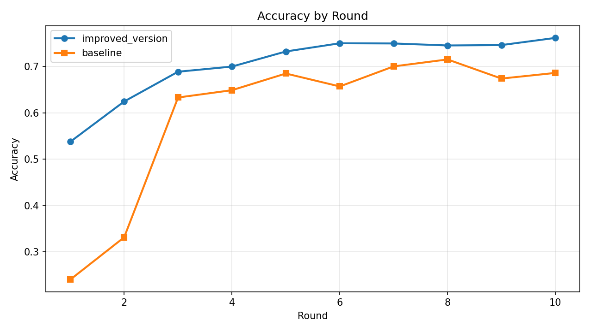
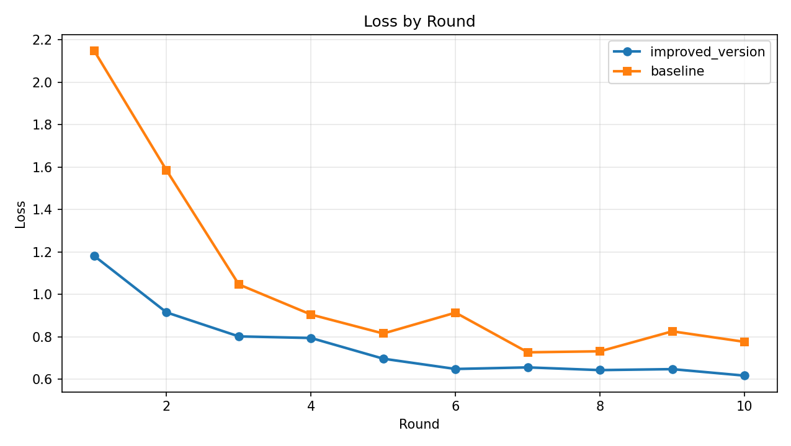

# Flower Results Comparison (Server Metrics)

## Summary
- Generated at: 2026-04-15T12:35:40+08:00
- Rounds observed (improved_version): 10
- Rounds observed (baseline): 10

## Key Metrics
| Metric | improved_version | baseline | Delta (improved_version - baseline) |
|---|---:|---:|---:|
| Final accuracy | 0.7619 | 0.6863 | 0.0756 |
| Final loss | 0.6167 | 0.7759 | -0.1591 |
| Best accuracy | 0.7619 (r10) | 0.7154 (r8) | 0.0465 |
| Lowest loss | 0.6167 (r10) | 0.7266 (r7) | -0.1098 |
| Mean accuracy | 0.7038 | 0.5972 | 0.1066 |

## Winners
- Final accuracy winner: improved_version
- Final loss winner: improved_version
- Best accuracy winner: improved_version
- Lowest loss winner: improved_version
- Mean accuracy winner: improved_version
- Total score: improved_version=5 | baseline=0 | tie=0 | n/a=0
- Overall winner: improved_version

## Per-round Metrics
| Round | improved_version Accuracy | baseline Accuracy | improved_version Loss | baseline Loss |
|---:|---:|---:|---:|---:|
| 1 | 0.5376 | 0.2400 | 1.1805 | 2.1470 |
| 2 | 0.6246 | 0.3313 | 0.9146 | 1.5843 |
| 3 | 0.6889 | 0.6332 | 0.8016 | 1.0465 |
| 4 | 0.7000 | 0.6490 | 0.7941 | 0.9044 |
| 5 | 0.7326 | 0.6850 | 0.6965 | 0.8152 |
| 6 | 0.7503 | 0.6571 | 0.6480 | 0.9135 |
| 7 | 0.7499 | 0.7004 | 0.6555 | 0.7266 |
| 8 | 0.7456 | 0.7154 | 0.6427 | 0.7313 |
| 9 | 0.7464 | 0.6741 | 0.6473 | 0.8255 |
| 10 | 0.7619 | 0.6863 | 0.6167 | 0.7759 |

## Per-round Deltas (improved_version - baseline)
| Round | Accuracy Delta | Loss Delta |
|---:|---:|---:|
| 1 | 0.2976 | -0.9664 |
| 2 | 0.2933 | -0.6696 |
| 3 | 0.0557 | -0.2449 |
| 4 | 0.0510 | -0.1103 |
| 5 | 0.0476 | -0.1187 |
| 6 | 0.0932 | -0.2655 |
| 7 | 0.0495 | -0.0710 |
| 8 | 0.0302 | -0.0887 |
| 9 | 0.0723 | -0.1782 |
| 10 | 0.0756 | -0.1591 |

## Plots
### Accuracy

### Loss

