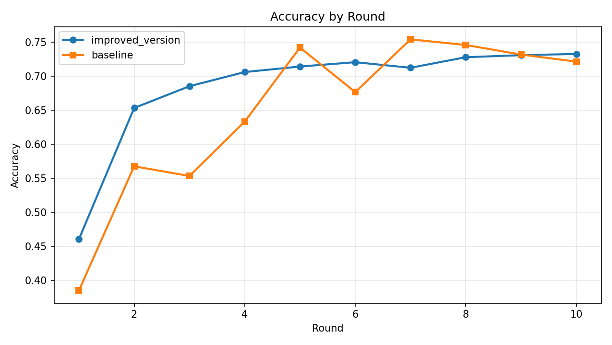
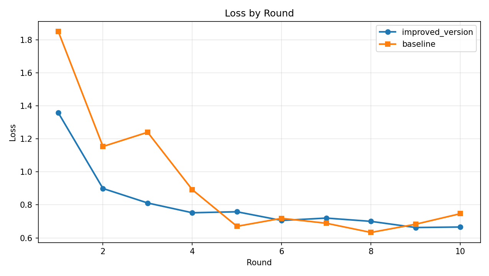

# Flower Results Comparison (Server Metrics)

## Summary
- Generated at: 2026-04-15T12:39:26+08:00
- Rounds observed (improved_version): 10
- Rounds observed (baseline): 10

## Key Metrics
| Metric | improved_version | baseline | Delta (improved_version - baseline) |
|---|---:|---:|---:|
| Final accuracy | 0.7329 | 0.7216 | 0.0113 |
| Final loss | 0.6658 | 0.7466 | -0.0808 |
| Best accuracy | 0.7329 (r10) | 0.7543 (r7) | -0.0214 |
| Lowest loss | 0.6628 (r9) | 0.6330 (r8) | 0.0299 |
| Mean accuracy | 0.6846 | 0.6513 | 0.0333 |

## Winners
- Final accuracy winner: improved_version
- Final loss winner: improved_version
- Best accuracy winner: baseline
- Lowest loss winner: baseline
- Mean accuracy winner: improved_version
- Total score: improved_version=3 | baseline=2 | tie=0 | n/a=0
- Overall winner: improved_version

## Per-round Metrics
| Round | improved_version Accuracy | baseline Accuracy | improved_version Loss | baseline Loss |
|---:|---:|---:|---:|---:|
| 1 | 0.4606 | 0.3852 | 1.3581 | 1.8506 |
| 2 | 0.6535 | 0.5678 | 0.8995 | 1.1539 |
| 3 | 0.6855 | 0.5536 | 0.8115 | 1.2401 |
| 4 | 0.7063 | 0.6335 | 0.7523 | 0.8922 |
| 5 | 0.7144 | 0.7423 | 0.7583 | 0.6701 |
| 6 | 0.7208 | 0.6768 | 0.7057 | 0.7186 |
| 7 | 0.7126 | 0.7543 | 0.7200 | 0.6887 |
| 8 | 0.7281 | 0.7461 | 0.7002 | 0.6330 |
| 9 | 0.7311 | 0.7320 | 0.6628 | 0.6828 |
| 10 | 0.7329 | 0.7216 | 0.6658 | 0.7466 |

## Per-round Deltas (improved_version - baseline)
| Round | Accuracy Delta | Loss Delta |
|---:|---:|---:|
| 1 | 0.0754 | -0.4925 |
| 2 | 0.0857 | -0.2543 |
| 3 | 0.1319 | -0.4285 |
| 4 | 0.0728 | -0.1399 |
| 5 | -0.0279 | 0.0882 |
| 6 | 0.0440 | -0.0129 |
| 7 | -0.0417 | 0.0313 |
| 8 | -0.0180 | 0.0672 |
| 9 | -0.0009 | -0.0200 |
| 10 | 0.0113 | -0.0808 |

## Plots
### Accuracy

### Loss

