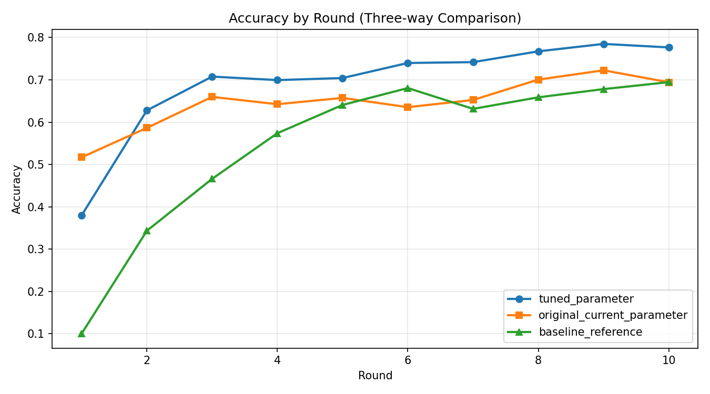
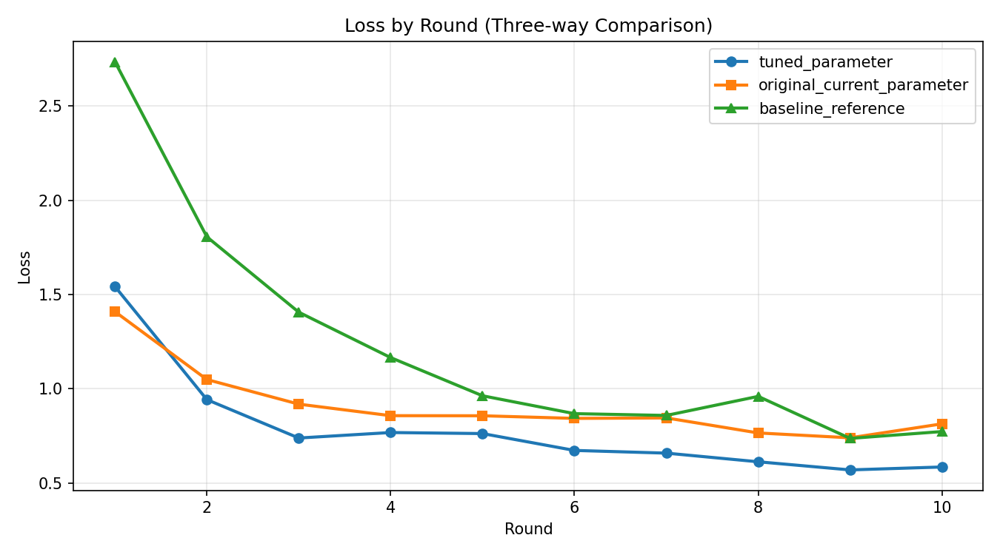

# Flower Results Comparison (Best Accuracy Focus)

## Summary
- Generated at: 2026-04-16T17:48:42+08:00
- Compared variants: tuned_parameter vs original_current_parameter vs baseline_reference
- Rounds observed (tuned_parameter): 10
- Rounds observed (original_current_parameter): 10
- Rounds observed (baseline_reference): 10

## Parameter Config
| Parameter | tuned_parameter | original_current_parameter | baseline_reference |
|---|---|---|---|
| fraction-evaluate | 0.5 | 0.5 | 0.5 |
| fraction-train | 0.25 | 0.25 | 0.25 |
| local-epochs | 1 | 1 | 1 |
| num-server-rounds | 10 | 10 | 10 |
| resource-score-alpha | 0.12 | 0.4 | n/a |
| resource-score-beta | 0.83 | 0.4 | n/a |
| resource-score-gamma | 0.05 | 0.2 | n/a |
| server-device | cpu | cpu | cpu |

## Primary Metric (Best Accuracy)
| Metric | tuned_parameter | original_current_parameter | baseline_reference |
|---|---:|---:|---:|
| Best accuracy | 0.7850 (r9) | 0.7226 (r9) | 0.6946 (r10) |

### Best Accuracy Deltas
- tuned_parameter - original_current_parameter: 0.0624
- tuned_parameter - baseline_reference: 0.0904
- original_current_parameter - baseline_reference: 0.0280

## Winners
- Best accuracy winner: tuned_parameter
- Rank 1: tuned_parameter (0.7850 (r9))
- Rank 2: original_current_parameter (0.7226 (r9))
- Rank 3: baseline_reference (0.6946 (r10))

## Per-round Accuracy
| Round | tuned_parameter Accuracy | original_current_parameter Accuracy | baseline_reference Accuracy |
|---:|---:|---:|---:|
| 1 | 0.3796 | 0.5169 | 0.1000 |
| 2 | 0.6278 | 0.5864 | 0.3432 |
| 3 | 0.7077 | 0.6597 | 0.4659 |
| 4 | 0.6994 | 0.6424 | 0.5738 |
| 5 | 0.7043 | 0.6573 | 0.6407 |
| 6 | 0.7399 | 0.6354 | 0.6806 |
| 7 | 0.7419 | 0.6524 | 0.6314 |
| 8 | 0.7674 | 0.7006 | 0.6587 |
| 9 | 0.7850 | 0.7226 | 0.6781 |
| 10 | 0.7767 | 0.6943 | 0.6946 |

## Per-round Accuracy Deltas (tuned_parameter, original_current_parameter, baseline_reference)
| Round | tuned_parameter - original_current_parameter | tuned_parameter - baseline_reference | original_current_parameter - baseline_reference |
|---:|---:|---:|---:|
| 1 | -0.1373 | 0.2796 | 0.4169 |
| 2 | 0.0414 | 0.2846 | 0.2432 |
| 3 | 0.0480 | 0.2418 | 0.1938 |
| 4 | 0.0570 | 0.1256 | 0.0686 |
| 5 | 0.0470 | 0.0636 | 0.0166 |
| 6 | 0.1045 | 0.0593 | -0.0452 |
| 7 | 0.0895 | 0.1105 | 0.0210 |
| 8 | 0.0668 | 0.1087 | 0.0419 |
| 9 | 0.0624 | 0.1069 | 0.0445 |
| 10 | 0.0824 | 0.0821 | -0.0003 |

## Plots
### Accuracy

### Loss

