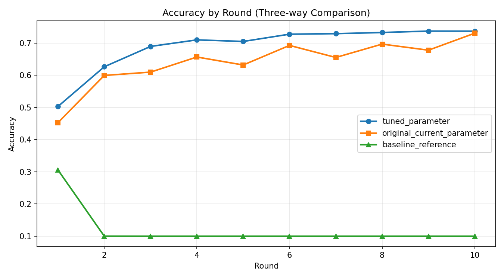
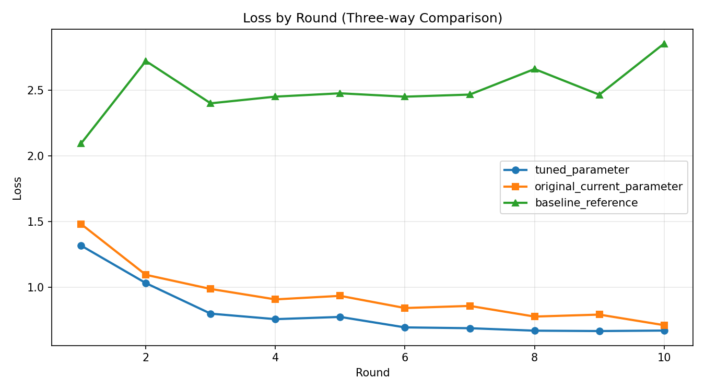

# Flower Results Comparison (Best Accuracy Focus)

## Summary
- Generated at: 2026-04-16T17:54:03+08:00
- Compared variants: tuned_parameter vs original_current_parameter vs baseline_reference
- Rounds observed (tuned_parameter): 10
- Rounds observed (original_current_parameter): 10
- Rounds observed (baseline_reference): 10

## Parameter Config
| Parameter | tuned_parameter | original_current_parameter | baseline_reference |
|---|---|---|---|
| fraction-evaluate | 0.5 | 0.5 | 0.5 |
| fraction-train | 0.25 | 0.25 | 0.25 |
| local-epochs | 1 | 1 | 1 |
| num-server-rounds | 10 | 10 | 10 |
| resource-score-alpha | 0.12 | 0.4 | n/a |
| resource-score-beta | 0.83 | 0.4 | n/a |
| resource-score-gamma | 0.05 | 0.2 | n/a |
| server-device | cpu | cpu | cpu |

## Primary Metric (Best Accuracy)
| Metric | tuned_parameter | original_current_parameter | baseline_reference |
|---|---:|---:|---:|
| Best accuracy | 0.7370 (r9) | 0.7304 (r10) | 0.3058 (r1) |

### Best Accuracy Deltas
- tuned_parameter - original_current_parameter: 0.0066
- tuned_parameter - baseline_reference: 0.4312
- original_current_parameter - baseline_reference: 0.4246

## Winners
- Best accuracy winner: tuned_parameter
- Rank 1: tuned_parameter (0.7370 (r9))
- Rank 2: original_current_parameter (0.7304 (r10))
- Rank 3: baseline_reference (0.3058 (r1))

## Per-round Accuracy
| Round | tuned_parameter Accuracy | original_current_parameter Accuracy | baseline_reference Accuracy |
|---:|---:|---:|---:|
| 1 | 0.5029 | 0.4526 | 0.3058 |
| 2 | 0.6262 | 0.5993 | 0.1002 |
| 3 | 0.6894 | 0.6096 | 0.1000 |
| 4 | 0.7097 | 0.6565 | 0.1000 |
| 5 | 0.7048 | 0.6317 | 0.1000 |
| 6 | 0.7274 | 0.6925 | 0.1000 |
| 7 | 0.7290 | 0.6551 | 0.1000 |
| 8 | 0.7326 | 0.6966 | 0.1000 |
| 9 | 0.7370 | 0.6777 | 0.1000 |
| 10 | 0.7368 | 0.7304 | 0.1000 |

## Per-round Accuracy Deltas (tuned_parameter, original_current_parameter, baseline_reference)
| Round | tuned_parameter - original_current_parameter | tuned_parameter - baseline_reference | original_current_parameter - baseline_reference |
|---:|---:|---:|---:|
| 1 | 0.0503 | 0.1971 | 0.1468 |
| 2 | 0.0269 | 0.5260 | 0.4991 |
| 3 | 0.0798 | 0.5894 | 0.5096 |
| 4 | 0.0532 | 0.6097 | 0.5565 |
| 5 | 0.0731 | 0.6048 | 0.5317 |
| 6 | 0.0349 | 0.6274 | 0.5925 |
| 7 | 0.0739 | 0.6290 | 0.5551 |
| 8 | 0.0360 | 0.6326 | 0.5966 |
| 9 | 0.0593 | 0.6370 | 0.5777 |
| 10 | 0.0064 | 0.6368 | 0.6304 |

## Plots
### Accuracy

### Loss

