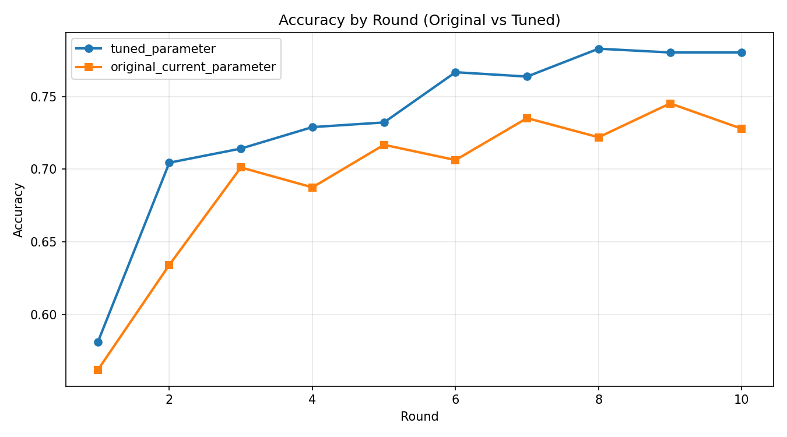
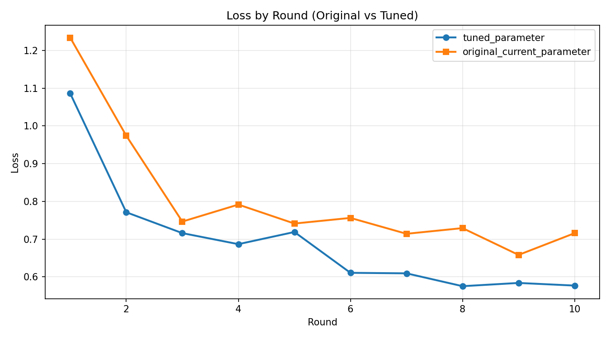

# Flower Results Comparison (Original vs Tuned)

## Summary
- Generated at: 2026-04-17T06:52:16+08:00
- Compared variants: original_current_parameter vs tuned_parameter
- Rounds observed (tuned_parameter): 10
- Rounds observed (original_current_parameter): 10

## Parameter Config
| Parameter | tuned_parameter | original_current_parameter |
|---|---|---|
| fraction-evaluate | 0.5 | 0.5 |
| fraction-train | 0.25 | 0.25 |
| local-epochs | 1 | 1 |
| num-server-rounds | 10 | 10 |
| resource-score-alpha | 0.12 | 0.4 |
| resource-score-beta | 0.83 | 0.4 |
| resource-score-gamma | 0.05 | 0.2 |
| server-device | cpu | cpu |

## Primary Metric (Best Accuracy)
| Metric | tuned_parameter | original_current_parameter | Delta (tuned_parameter - original_current_parameter) |
|---|---:|---:|---:|
| Best accuracy | 0.7830 (r8) | 0.7453 (r9) | 0.0377 |

### Best Accuracy Delta
- tuned_parameter - original_current_parameter: 0.0377

## Winners
- Best accuracy winner: tuned_parameter
- Rank 1: tuned_parameter (0.7830 (r8))
- Rank 2: original_current_parameter (0.7453 (r9))

## Per-round Accuracy
| Round | tuned_parameter Accuracy | original_current_parameter Accuracy |
|---:|---:|---:|
| 1 | 0.5809 | 0.5617 |
| 2 | 0.7045 | 0.6341 |
| 3 | 0.7142 | 0.7012 |
| 4 | 0.7290 | 0.6875 |
| 5 | 0.7322 | 0.7168 |
| 6 | 0.7668 | 0.7063 |
| 7 | 0.7638 | 0.7352 |
| 8 | 0.7830 | 0.7220 |
| 9 | 0.7804 | 0.7453 |
| 10 | 0.7804 | 0.7279 |

## Per-round Accuracy Deltas (tuned_parameter - original_current_parameter)
| Round | Delta |
|---:|---:|
| 1 | 0.0192 |
| 2 | 0.0704 |
| 3 | 0.0130 |
| 4 | 0.0415 |
| 5 | 0.0154 |
| 6 | 0.0605 |
| 7 | 0.0286 |
| 8 | 0.0610 |
| 9 | 0.0351 |
| 10 | 0.0525 |

## Plots
### Accuracy

### Loss

