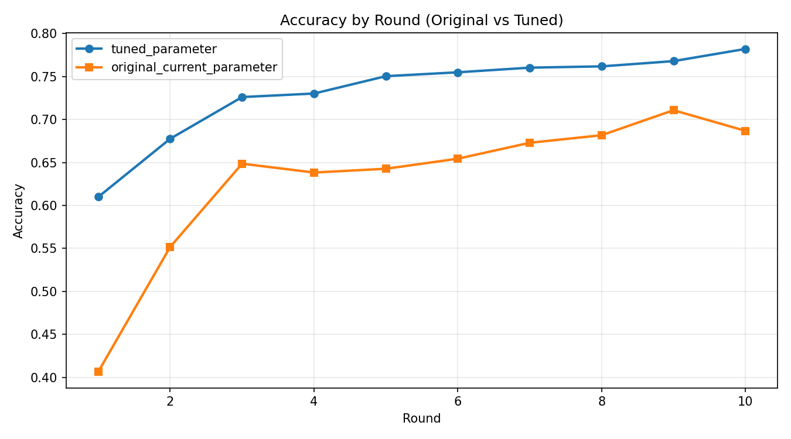
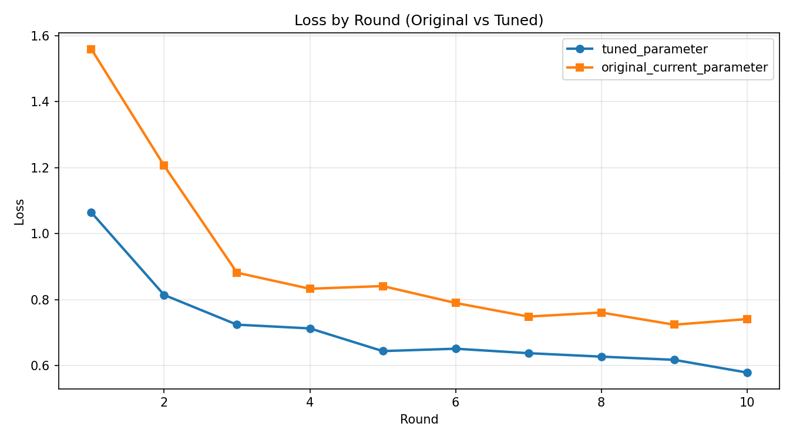

# Flower Results Comparison (Original vs Tuned)

## Summary
- Generated at: 2026-04-17T06:52:17+08:00
- Compared variants: original_current_parameter vs tuned_parameter
- Rounds observed (tuned_parameter): 10
- Rounds observed (original_current_parameter): 10

## Parameter Config
| Parameter | tuned_parameter | original_current_parameter |
|---|---|---|
| fraction-evaluate | 0.5 | 0.5 |
| fraction-train | 0.25 | 0.25 |
| local-epochs | 1 | 1 |
| num-server-rounds | 10 | 10 |
| resource-score-alpha | 0.12 | 0.4 |
| resource-score-beta | 0.83 | 0.4 |
| resource-score-gamma | 0.05 | 0.2 |
| server-device | cpu | cpu |

## Primary Metric (Best Accuracy)
| Metric | tuned_parameter | original_current_parameter | Delta (tuned_parameter - original_current_parameter) |
|---|---:|---:|---:|
| Best accuracy | 0.7821 (r10) | 0.7108 (r9) | 0.0713 |

### Best Accuracy Delta
- tuned_parameter - original_current_parameter: 0.0713

## Winners
- Best accuracy winner: tuned_parameter
- Rank 1: tuned_parameter (0.7821 (r10))
- Rank 2: original_current_parameter (0.7108 (r9))

## Per-round Accuracy
| Round | tuned_parameter Accuracy | original_current_parameter Accuracy |
|---:|---:|---:|
| 1 | 0.6099 | 0.4066 |
| 2 | 0.6776 | 0.5518 |
| 3 | 0.7261 | 0.6486 |
| 4 | 0.7302 | 0.6383 |
| 5 | 0.7504 | 0.6427 |
| 6 | 0.7549 | 0.6544 |
| 7 | 0.7603 | 0.6729 |
| 8 | 0.7618 | 0.6817 |
| 9 | 0.7679 | 0.7108 |
| 10 | 0.7821 | 0.6868 |

## Per-round Accuracy Deltas (tuned_parameter - original_current_parameter)
| Round | Delta |
|---:|---:|
| 1 | 0.2033 |
| 2 | 0.1258 |
| 3 | 0.0775 |
| 4 | 0.0919 |
| 5 | 0.1077 |
| 6 | 0.1005 |
| 7 | 0.0874 |
| 8 | 0.0801 |
| 9 | 0.0571 |
| 10 | 0.0953 |

## Plots
### Accuracy

### Loss

