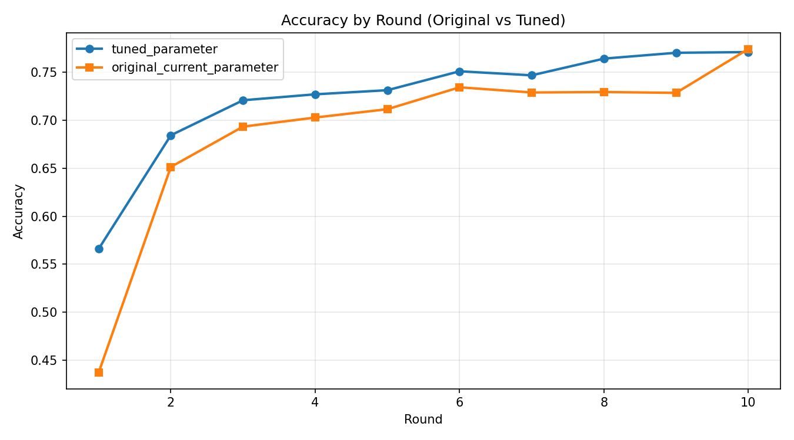
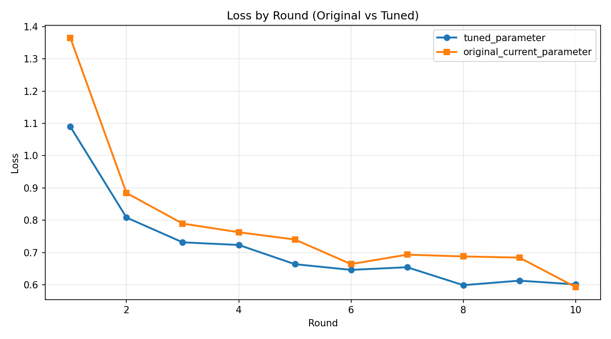

# Flower Results Comparison (Original vs Tuned)

## Summary
- Generated at: 2026-04-17T06:52:17+08:00
- Compared variants: original_current_parameter vs tuned_parameter
- Rounds observed (tuned_parameter): 10
- Rounds observed (original_current_parameter): 10

## Parameter Config
| Parameter | tuned_parameter | original_current_parameter |
|---|---|---|
| fraction-evaluate | 0.5 | 0.5 |
| fraction-train | 0.25 | 0.25 |
| local-epochs | 1 | 1 |
| num-server-rounds | 10 | 10 |
| resource-score-alpha | 0.12 | 0.4 |
| resource-score-beta | 0.83 | 0.4 |
| resource-score-gamma | 0.05 | 0.2 |
| server-device | cpu | cpu |

## Primary Metric (Best Accuracy)
| Metric | tuned_parameter | original_current_parameter | Delta (tuned_parameter - original_current_parameter) |
|---|---:|---:|---:|
| Best accuracy | 0.7711 (r10) | 0.7743 (r10) | -0.0032 |

### Best Accuracy Delta
- tuned_parameter - original_current_parameter: -0.0032

## Winners
- Best accuracy winner: original_current_parameter
- Rank 1: original_current_parameter (0.7743 (r10))
- Rank 2: tuned_parameter (0.7711 (r10))

## Per-round Accuracy
| Round | tuned_parameter Accuracy | original_current_parameter Accuracy |
|---:|---:|---:|
| 1 | 0.5660 | 0.4371 |
| 2 | 0.6844 | 0.6514 |
| 3 | 0.7209 | 0.6934 |
| 4 | 0.7271 | 0.7029 |
| 5 | 0.7314 | 0.7116 |
| 6 | 0.7511 | 0.7344 |
| 7 | 0.7469 | 0.7290 |
| 8 | 0.7643 | 0.7295 |
| 9 | 0.7704 | 0.7286 |
| 10 | 0.7711 | 0.7743 |

## Per-round Accuracy Deltas (tuned_parameter - original_current_parameter)
| Round | Delta |
|---:|---:|
| 1 | 0.1289 |
| 2 | 0.0330 |
| 3 | 0.0275 |
| 4 | 0.0242 |
| 5 | 0.0198 |
| 6 | 0.0167 |
| 7 | 0.0179 |
| 8 | 0.0348 |
| 9 | 0.0418 |
| 10 | -0.0032 |

## Plots
### Accuracy

### Loss

