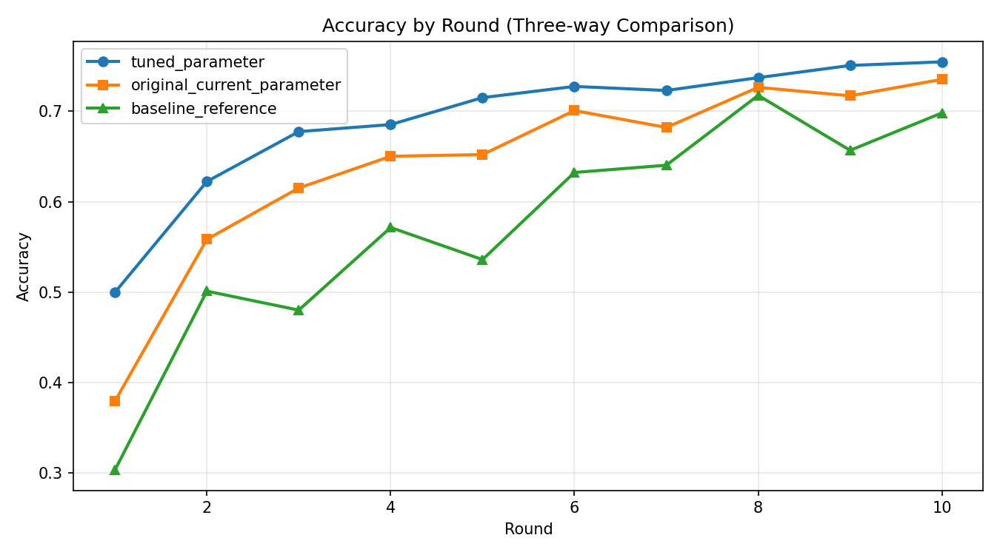
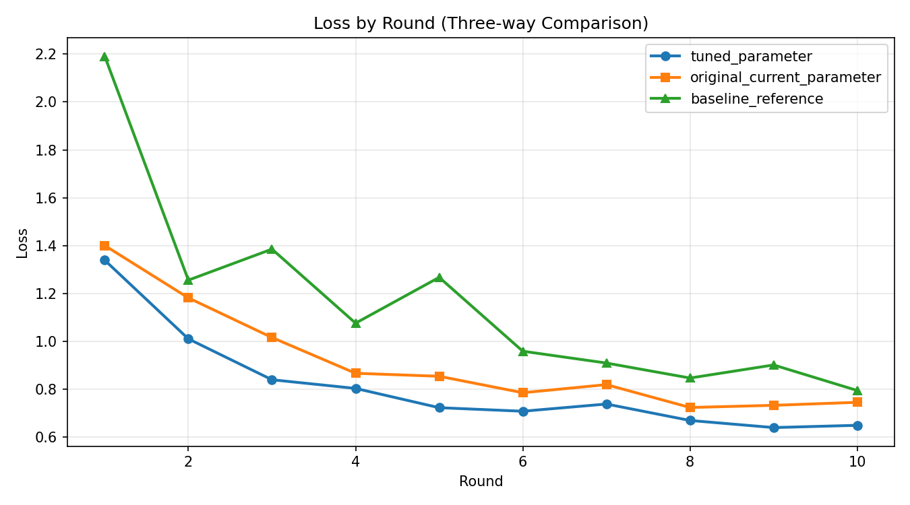

# Flower Results Comparison (Best Accuracy Focus)

## Summary
- Generated at: 2026-04-17T06:41:13+08:00
- Compared variants: tuned_parameter vs original_current_parameter vs baseline_reference
- Rounds observed (tuned_parameter): 10
- Rounds observed (original_current_parameter): 10
- Rounds observed (baseline_reference): 10

## Parameter Config
| Parameter | tuned_parameter | original_current_parameter | baseline_reference |
|---|---|---|---|
| fraction-evaluate | 0.5 | 0.5 | 0.5 |
| fraction-train | 0.25 | 0.25 | 0.25 |
| local-epochs | 1 | 1 | 1 |
| num-server-rounds | 10 | 10 | 10 |
| resource-score-alpha | 0.12 | 0.4 | n/a |
| resource-score-beta | 0.83 | 0.4 | n/a |
| resource-score-gamma | 0.05 | 0.2 | n/a |
| server-device | cpu | cpu | cpu |

## Primary Metric (Best Accuracy)
| Metric | tuned_parameter | original_current_parameter | baseline_reference |
|---|---:|---:|---:|
| Best accuracy | 0.7547 (r10) | 0.7353 (r10) | 0.7176 (r8) |

### Best Accuracy Deltas
- tuned_parameter - original_current_parameter: 0.0194
- tuned_parameter - baseline_reference: 0.0371
- original_current_parameter - baseline_reference: 0.0177

## Winners
- Best accuracy winner: tuned_parameter
- Rank 1: tuned_parameter (0.7547 (r10))
- Rank 2: original_current_parameter (0.7353 (r10))
- Rank 3: baseline_reference (0.7176 (r8))

## Per-round Accuracy
| Round | tuned_parameter Accuracy | original_current_parameter Accuracy | baseline_reference Accuracy |
|---:|---:|---:|---:|
| 1 | 0.4997 | 0.3793 | 0.3032 |
| 2 | 0.6223 | 0.5583 | 0.5010 |
| 3 | 0.6775 | 0.6151 | 0.4800 |
| 4 | 0.6853 | 0.6502 | 0.5714 |
| 5 | 0.7151 | 0.6521 | 0.5359 |
| 6 | 0.7275 | 0.7008 | 0.6323 |
| 7 | 0.7230 | 0.6821 | 0.6403 |
| 8 | 0.7372 | 0.7265 | 0.7176 |
| 9 | 0.7507 | 0.7171 | 0.6568 |
| 10 | 0.7547 | 0.7353 | 0.6982 |

## Per-round Accuracy Deltas (tuned_parameter, original_current_parameter, baseline_reference)
| Round | tuned_parameter - original_current_parameter | tuned_parameter - baseline_reference | original_current_parameter - baseline_reference |
|---:|---:|---:|---:|
| 1 | 0.1204 | 0.1965 | 0.0761 |
| 2 | 0.0640 | 0.1213 | 0.0573 |
| 3 | 0.0624 | 0.1975 | 0.1351 |
| 4 | 0.0351 | 0.1139 | 0.0788 |
| 5 | 0.0630 | 0.1792 | 0.1162 |
| 6 | 0.0267 | 0.0952 | 0.0685 |
| 7 | 0.0409 | 0.0827 | 0.0418 |
| 8 | 0.0107 | 0.0196 | 0.0089 |
| 9 | 0.0336 | 0.0939 | 0.0603 |
| 10 | 0.0194 | 0.0565 | 0.0371 |

## Plots
### Accuracy

### Loss

