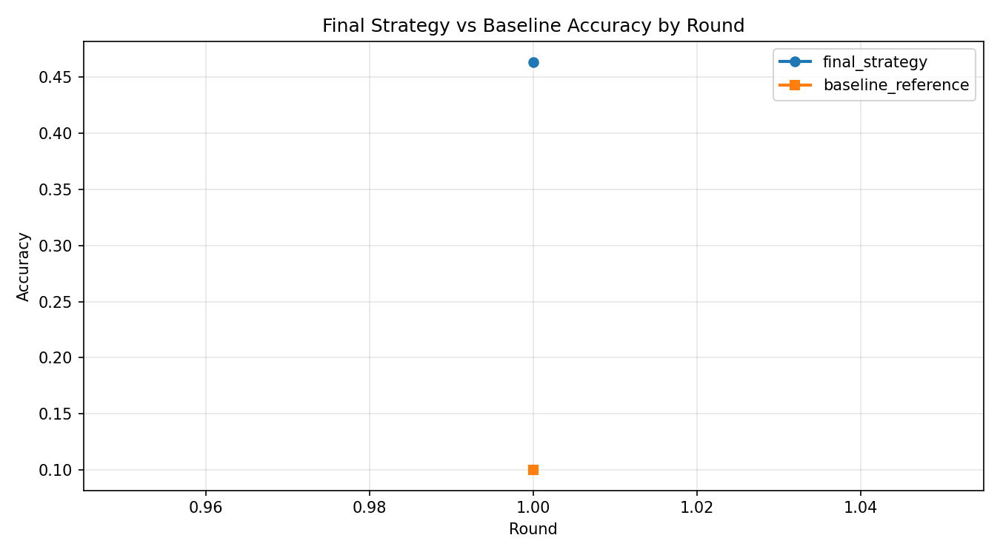
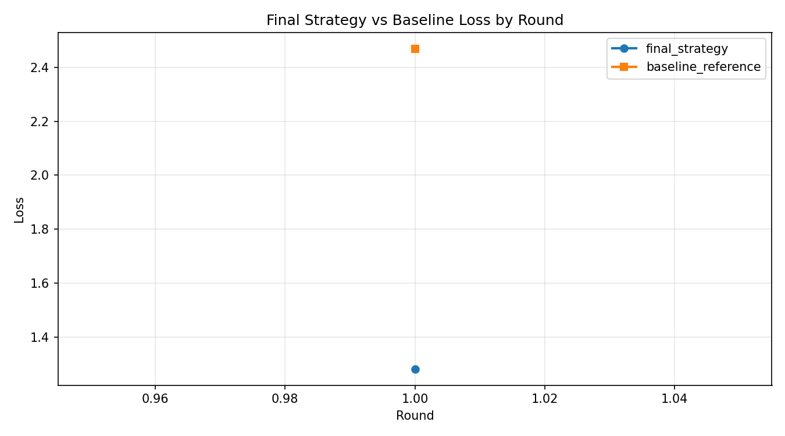

# Final Strategy Report (Final vs Baseline)

## Summary
- Generated at: 2026-04-17T07:14:09+08:00
- Report tag: final_strategy_vs_baseline
- Compared variants: final_strategy vs baseline_reference
- Rounds observed (final_strategy): 1
- Rounds observed (baseline_reference): 1

## Parameter Config
| Parameter | final_strategy | baseline_reference |
|---|---|---|
| fraction-evaluate | 0.5 | 0.5 |
| fraction-train | 0.25 | 0.25 |
| local-epochs | 1 | 1 |
| num-server-rounds | 1 | 1 |
| resource-score-alpha | 0.4 | n/a |
| resource-score-beta | 0.4 | n/a |
| resource-score-gamma | 0.2 | n/a |
| server-device | cpu | cpu |

## Primary Metric (Best Accuracy)
| Metric | final_strategy | baseline_reference | Delta (final_strategy - baseline_reference) |
|---|---:|---:|---:|
| Best accuracy | 0.4635 (r1) | 0.1001 (r1) | 0.3634 |

## Winners
- Best accuracy winner: final_strategy
- Rank 1: final_strategy (0.4635 (r1))
- Rank 2: baseline_reference (0.1001 (r1))

## Per-round Accuracy
| Round | final_strategy Accuracy | baseline_reference Accuracy |
|---:|---:|---:|
| 1 | 0.4635 | 0.1001 |

## Per-round Accuracy Deltas (final_strategy - baseline_reference)
| Round | Delta |
|---:|---:|
| 1 | 0.3634 |

## Plots
### Accuracy

### Loss

