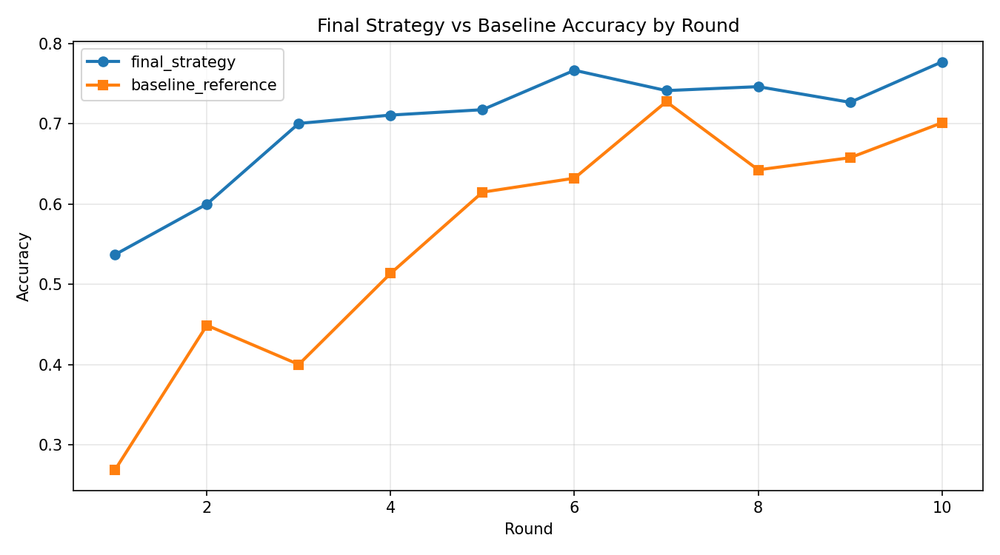
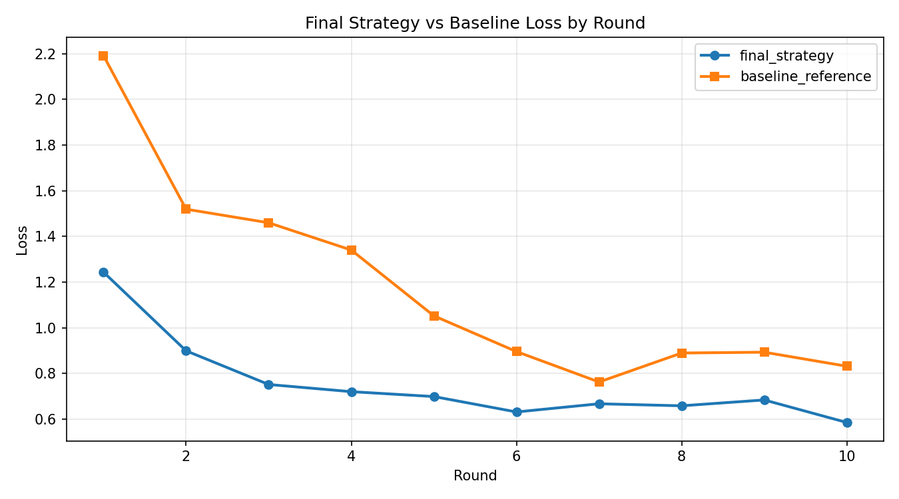

# Final Strategy Report (Final vs Baseline)

## Summary
- Generated at: 2026-04-17T07:27:47+08:00
- Report tag: final_strategy_vs_baseline
- Compared variants: final_strategy vs baseline_reference
- Rounds observed (final_strategy): 10
- Rounds observed (baseline_reference): 10

## Parameter Config
| Parameter | final_strategy | baseline_reference |
|---|---|---|
| fraction-evaluate | 0.5 | 0.5 |
| fraction-train | 0.25 | 0.25 |
| local-epochs | 1 | 1 |
| num-server-rounds | 10 | 10 |
| resource-score-alpha | 0.4 | n/a |
| resource-score-beta | 0.4 | n/a |
| resource-score-gamma | 0.2 | n/a |
| server-device | cpu | cpu |

## Primary Metric (Best Accuracy)
| Metric | final_strategy | baseline_reference | Delta (final_strategy - baseline_reference) |
|---|---:|---:|---:|
| Best accuracy | 0.7771 (r10) | 0.7275 (r7) | 0.0496 |

## Winners
- Best accuracy winner: final_strategy
- Rank 1: final_strategy (0.7771 (r10))
- Rank 2: baseline_reference (0.7275 (r7))

## Per-round Accuracy
| Round | final_strategy Accuracy | baseline_reference Accuracy |
|---:|---:|---:|
| 1 | 0.5370 | 0.2689 |
| 2 | 0.6000 | 0.4490 |
| 3 | 0.7004 | 0.4002 |
| 4 | 0.7108 | 0.5137 |
| 5 | 0.7175 | 0.6148 |
| 6 | 0.7666 | 0.6322 |
| 7 | 0.7413 | 0.7275 |
| 8 | 0.7462 | 0.6426 |
| 9 | 0.7267 | 0.6577 |
| 10 | 0.7771 | 0.7012 |

## Per-round Accuracy Deltas (final_strategy - baseline_reference)
| Round | Delta |
|---:|---:|
| 1 | 0.2681 |
| 2 | 0.1510 |
| 3 | 0.3002 |
| 4 | 0.1971 |
| 5 | 0.1027 |
| 6 | 0.1344 |
| 7 | 0.0138 |
| 8 | 0.1036 |
| 9 | 0.0690 |
| 10 | 0.0759 |

## Plots
### Accuracy

### Loss

